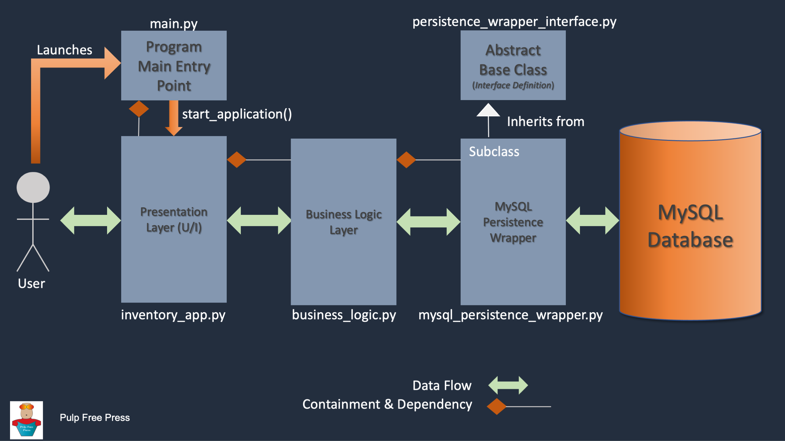

# Clean Architecture Example

This project demonstrates the following concepts:
- Separation of concerns
- Database design evolution

## The Database
The database design has been altered from the simple one-table design shown in the sql_test_project. There are now two tables: inventories and items. There are two database script folders: **db_version_1** and **db_version_2**. The `initialize_database.sh` script does the following:
-  First, it creates version 1 of the database by calling all the scripts in the **db_version_1** directory. This results in a database named `home_inventory`, a user named `home_inventory_user`, and one table named `items`, which is populated with test data.
-  Next, it calls the scripts in the **db_version_2** directory in the following order:
    - *create_inventories_table.sql*: Create a new table called `inventories`
    - *insert_inventory_row.sql*: Inserts one row into the inventories table. This must be done so that a foreign key can be added to the items table
    - *alter_items_table.sql*: Creates a new column to hold a foreign key value, then establishes a foreign key constraing between the items table and the inventories table

  ## Application Architecture
  
  
